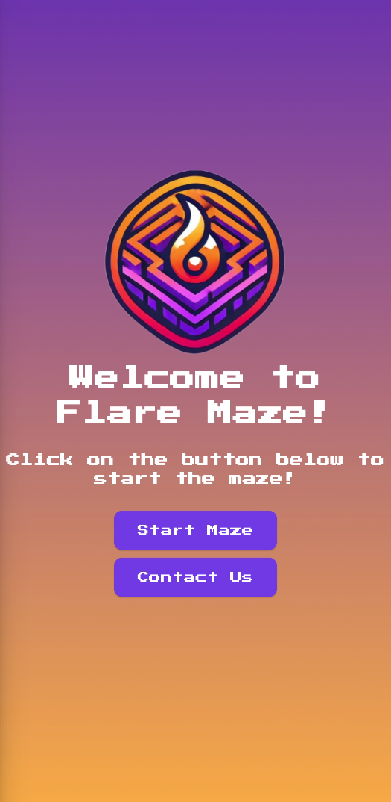
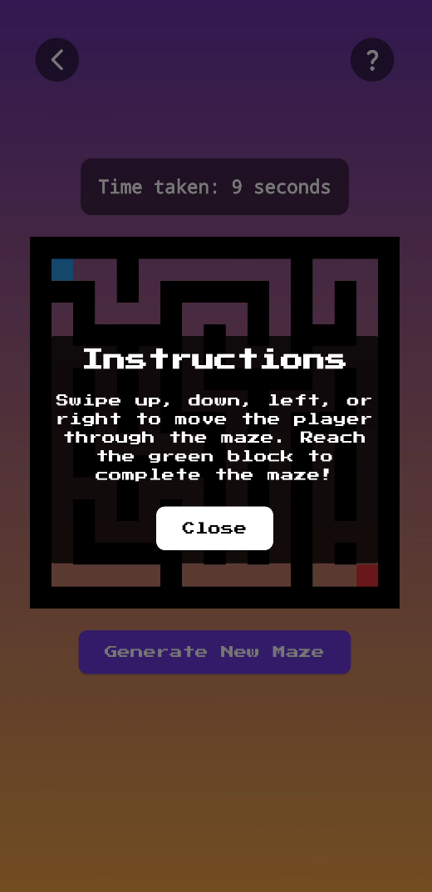
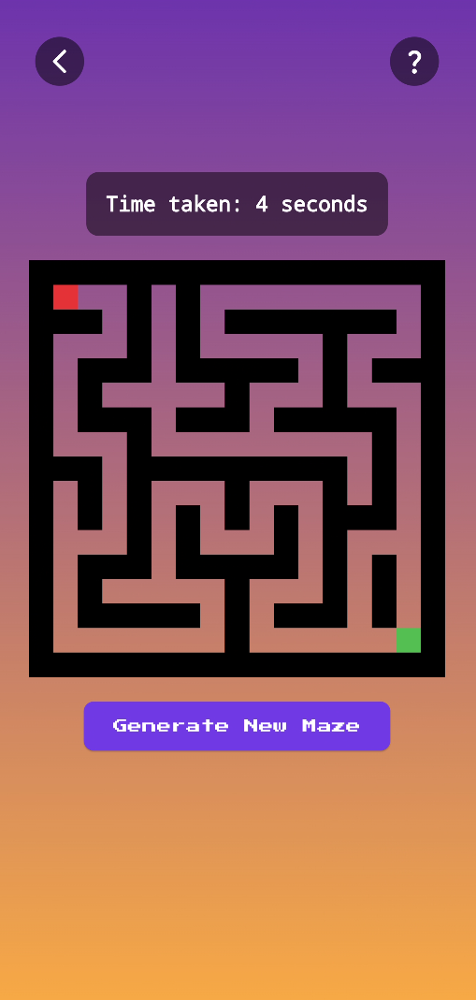
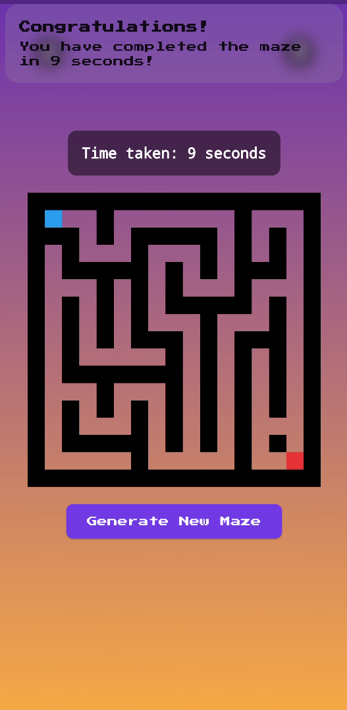

# FlareMaze

FlareMaze is a simple maze game built using Flutter and GetX for state management. The game generates random mazes and allows the player to navigate from the start point to the end point.

  

|||
|--------------|--------------|
|  |  |
|  |  |

## Features

- Generates a random, solvable maze on button press.
- Displays the time taken to solve the maze.
- Swipe gestures to move the player through the maze.

## How to Play

- **Start a new game:** Click the "Start Maze" button to initiate the game.
- **Generate a new randomize maze:** Click the "Generate New Maze" button to generate a new maze.
- **Navigate the maze:** Swipe up, down, left, or right to move the player (red block) through the maze.
- **Complete the maze:** Reach the end point (green block) to complete the maze. The time taken to solve the maze will be displayed.

Sure! Here is a more detailed explanation of the maze generation logic using the depth-first search (DFS) algorithm:

### Maze Generation Logic

The Depth-First Search algorithm is one of the oldest algorithms utilized in generating mazes. Indeed, it's simple and efficient; hence, perfect for this task. The following is a detailed explanation of exactly how the algorithm generates the maze:

1. **Initialization**:
    - Represented as a grid of cells, every cell in the maze might turn into either a wall (`1`) or simply a path (`0`).
    - A grid with all walls (`1`) is initialized.
    - The start-point configuration is at the top-left corner (0,0), and the endpoint is at the bottom-right corner (rows–1, cols–1).

2. **Carving Paths**:
   - This completion of DFS is where the algorithm starts from the start. It cuts a path from the current cell to some randomly chosen not visited yet neighbor.
   Note that neighbors are shuffled here for randomness sake.

3. **Recursive Path Creation**:
    - From the current cell, it considers all four directions (up, down, left and right) in a random order.
    - For each direction, he calculates the new cell position advancing two steps in that direction.
    - If the new cell is within the grid boundaries and has not been visited yet—a wall—then it carves a path for the said cell, setting both the middle cell and the new one to `0`.
    directions: Again, recursively continue from the new cell.
4. **Backtracking**:
    - If the algorithm lands on a cell from which all of its neighbors have already been visited, it backtracks to the previous cell and continues the process.

5. **Ensuring End Point Accessibility**:
    - Once DFS has been done, there is more to do to make the end point accessible.
    Well, it checks first of all whether both cells directly left and above the end are walls. If so, open one of them to let the end point be accessible.

## Dependencies

- Flutter
- GetX
- google_fonts
- flutter_native_splash
- url_launcher

## Author

Hamza Tariq
